---

layout: default
title: Приручаем SVG

---

# Яндекс

## **{{ site.presentation.title }}** {#cover}

<!-- 

    
{{ site.presentation.service }}

 -->





  
{{ site.author.name }},   {{ site.author.position }}

## Введение
{:.section}

### Что такое SVG

## SVG — Scalable Vector Graphics

### Производный формат VML (Microsoft) и PGML (разработан из Adobe PostScript)

### Спецификация: [www.w3.org/TR/SVG/](http://www.w3.org/TR/SVG/)

* Масштабируемая
* Чёткая на любых DPI
* XML-документ
* Можно редактировать в текстовом редакторе
* Может включать растровые изображения, ссылки, стили, скрипты

## Поддержка

* IE 9+
* Firefox 4+
* iOS
* Android 3+

## Пример кода: логотип SVG

~~~ markup
<svg xmlns="http://www.w3.org/2000/svg"
     xmlns:xlink="http://www.w3.org/1999/xlink" viewBox="0 0 300 300">
  <title>SVG Logo</title>
  <desc>Designed for the SVG Logo Contest in 2006 by Harvey Rayner, and
    adopted by W3C in 2009. It is available under the Creative Commons license
    for those who have an SVG product or who are using SVG on their site.</desc>
  <g stroke-width="38" stroke="#000">
    <g id="b" transform="translate(150 150)">
      <path id="a" fill="#ffb13b" d="M-84.15,-15.85
        a22.417,22.417 0 1 0 0,31.7 h168.3 a22.417,22.417 0 1 0 0,-31.7z"/>
      <use xlink:href="#a" transform="rotate(45)"/>
      <use xlink:href="#a" transform="rotate(90)"/>
      <use xlink:href="#a" transform="rotate(135)"/>
    </g>
  </g>
  <use xlink:href="#b"/>
</svg>
~~~

## Как выглядит в браузере: логотип SVG
{:.center}

{:.horizontal-big}

## Примитивы

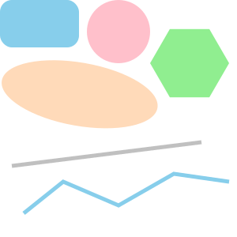{:.right-image}

~~~ markup
<rect x="0" y="0" width="100" height="60"
    rx="15" fill="skyblue"/>

<circle cx="150" cy="32" r="32" fill="pink"/>

<ellipse cx="120" cy="100" rx="100" ry="32"
    transform="rotate(10)" fill="peachpuff"/>

<line x1="15" y1="210" x2="255" y2="180"
    stroke="silver"/>

<polyline points="30,270 80,230 150,260 220,220
    290,230" stroke="tan" fill="none"/>

<polygon points="290,80 265,123.2 215,123.2 190,80 214.96,36.8 265,36.8"
    fill="lightgreen"/>
~~~
{:.top-code}

## Проба пера
{:.section}

### Начинаем рисовать

## Начинаем рисовать

{:.right-image.pixelated}

~~~ markup
<rect x="9" y="6"
      width="32" height="32" rx="5"
      stroke="black" stroke-width="1"
      fill="none"/>
~~~

## Рисунок в пикселях

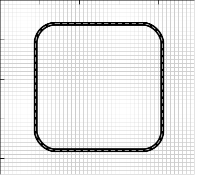{:.right-image}

~~~ markup
<rect x="9" y="6"
      width="32" height="32" rx="5"
      stroke="black" stroke-width="1"
      fill="none"/>
~~~

## Исправляем рисунок в пикселях

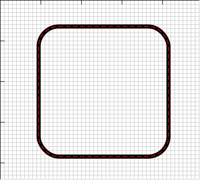{:.right-image}

~~~ markup
<rect x="9.5" y="6.5"
      width="32" height="32" rx="5"
      stroke="black" stroke-width="1"
      fill="none"/>
~~~

## Попали в пиксели

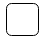{:.right-image.pixelated}

~~~ markup
<rect x="9.5" y="6.5"
      width="32" height="32" rx="5"
      stroke="black" stroke-width="1"
      fill="none"/>
~~~

## &nbsp;
{:.with-big-quote}
> Даже векторная графика отображается в пикселях

## Изучаем <path>
{:.section}

### Контуры

## Логотип auto.ru

{:.right-image-small}

~~~ markup
<svg xmlns="http://www.w3.org/2000/svg" viewBox="0 0 2580 1320">
  <path d="M 668,98 h 668 c 74,0 206,48 260,93 l 186,153
    c 72,60 164,100 257,111 l 258,32 a 171,171 0 0 1 146,165
    v 186 c 0,80 -59,143 -146,143 h -191
    a 212,212 0 1 1 -212,-212 212,212 0 1 1 -212,212
    H 871 a 212,212 0 1 1 -212,-212 212,212 0 1 1 -212,212
    H 256 c -90,0 -158,-70 -158,-144 V 651
    c 0,-64 54,-193 108,-247
    l 210,-204 c 48,-48 177,-102 251,-102 z"
    stroke="#000" stroke-width="197" fill="none"/>
</svg>
~~~

## Начальная точка

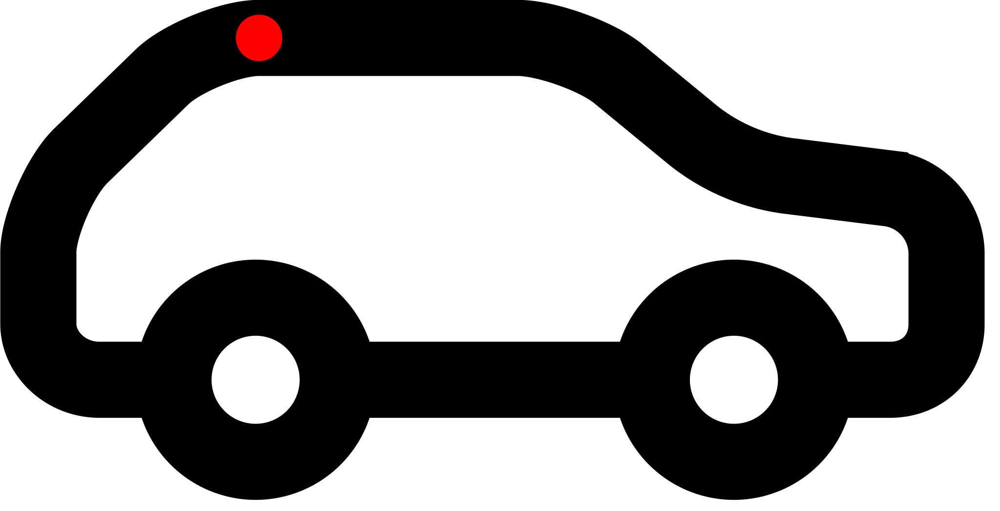{:.right-image-small}

~~~ markup
<svg xmlns="http://www.w3.org/2000/svg" viewBox="0 0 2580 1320">
  <path d="         h 668 c 74,0 206,48 260,93 l 186,153
    c 72,60 164,100 257,111 l 258,32 a 171,171 0 0 1 146,165
    v 186 c 0,80 -59,143 -146,143 h -191
    a 212,212 0 1 1 -212,-212 212,212 0 1 1 -212,212
    H 871 a 212,212 0 1 1 -212,-212 212,212 0 1 1 -212,212
    H 256 c -90,0 -158,-70 -158,-144 V 651
    c 0,-64 54,-193 108,-247
    l 210,-204 c 48,-48 177,-102 251,-102 z"
    stroke="#000" stroke-width="197" fill="none"/>
</svg>
~~~

~~~ highlight

           M 668,98
~~~

## Горинтальная прямая

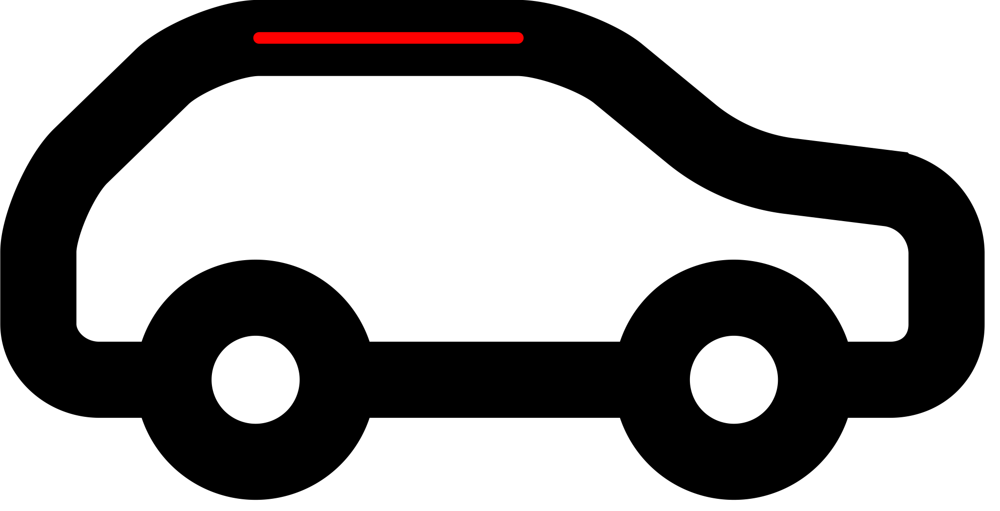{:.right-image-small}

~~~ markup
<svg xmlns="http://www.w3.org/2000/svg" viewBox="0 0 2580 1320">
  <path d="M 668,98       c 74,0 206,48 260,93 l 186,153
    c 72,60 164,100 257,111 l 258,32 a 171,171 0 0 1 146,165
    v 186 c 0,80 -59,143 -146,143 h -191
    a 212,212 0 1 1 -212,-212 212,212 0 1 1 -212,212
    H 871 a 212,212 0 1 1 -212,-212 212,212 0 1 1 -212,212
    H 256 c -90,0 -158,-70 -158,-144 V 651
    c 0,-64 54,-193 108,-247
    l 210,-204 c 48,-48 177,-102 251,-102 z"
    stroke="#000" stroke-width="197" fill="none"/>
</svg>
~~~

~~~ highlight

                    h 668
~~~

## Кривая Безье

{:.right-image-small}

~~~ markup
<svg xmlns="http://www.w3.org/2000/svg" viewBox="0 0 2580 1320">
  <path d="M 668,98 h 668                      l 186,153
    c 72,60 164,100 257,111 l 258,32 a 171,171 0 0 1 146,165
    v 186 c 0,80 -59,143 -146,143 h -191
    a 212,212 0 1 1 -212,-212 212,212 0 1 1 -212,212
    H 871 a 212,212 0 1 1 -212,-212 212,212 0 1 1 -212,212
    H 256 c -90,0 -158,-70 -158,-144 V 651
    c 0,-64 54,-193 108,-247
    l 210,-204 c 48,-48 177,-102 251,-102 z"
    stroke="#000" stroke-width="197" fill="none"/>
</svg>
~~~

~~~ highlight

                          c 74,0 206,48 260,93
~~~

## Прямая линия

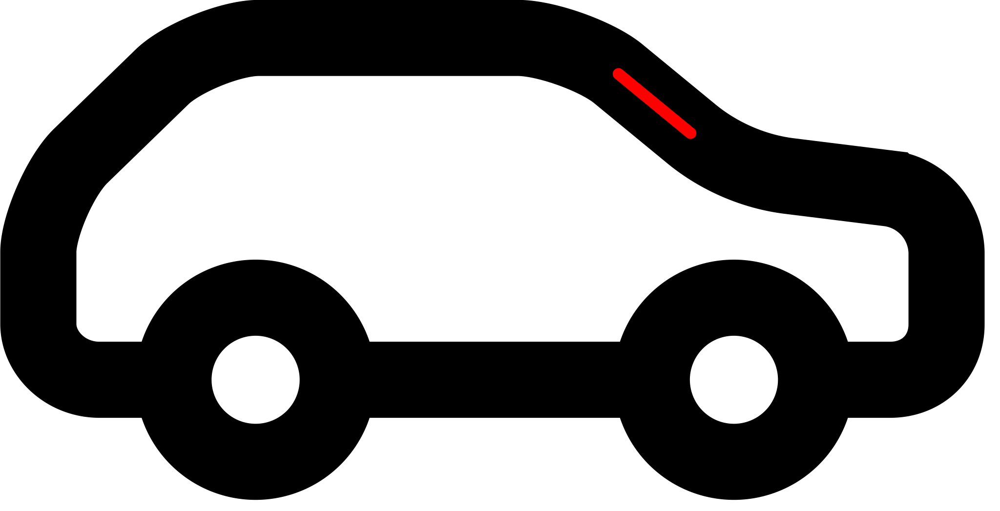{:.right-image-small}

~~~ markup
<svg xmlns="http://www.w3.org/2000/svg" viewBox="0 0 2580 1320">
  <path d="M 668,98 h 668 c 74,0 206,48 260,93
    c 72,60 164,100 257,111 l 258,32 a 171,171 0 0 1 146,165
    v 186 c 0,80 -59,143 -146,143 h -191
    a 212,212 0 1 1 -212,-212 212,212 0 1 1 -212,212
    H 871 a 212,212 0 1 1 -212,-212 212,212 0 1 1 -212,212
    H 256 c -90,0 -158,-70 -158,-144 V 651
    c 0,-64 54,-193 108,-247
    l 210,-204 c 48,-48 177,-102 251,-102 z"
    stroke="#000" stroke-width="197" fill="none"/>
</svg>
~~~

~~~ highlight

                                               l 186,153
~~~

## Кривая Безье

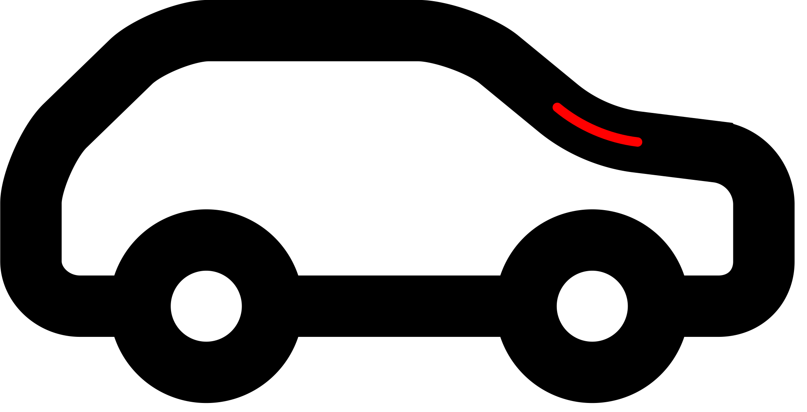{:.right-image-small}

~~~ markup
<svg xmlns="http://www.w3.org/2000/svg" viewBox="0 0 2580 1320">
  <path d="M 668,98 h 668 c 74,0 206,48 260,93 l 186,153
                            l 258,32 a 171,171 0 0 1 146,165
    v 186 c 0,80 -59,143 -146,143 h -191
    a 212,212 0 1 1 -212,-212 212,212 0 1 1 -212,212
    H 871 a 212,212 0 1 1 -212,-212 212,212 0 1 1 -212,212
    H 256 c -90,0 -158,-70 -158,-144 V 651
    c 0,-64 54,-193 108,-247
    l 210,-204 c 48,-48 177,-102 251,-102 z"
    stroke="#000" stroke-width="197" fill="none"/>
</svg>
~~~

~~~ highlight

    c 72,60 164,100 257,111
~~~

## Прямая линия

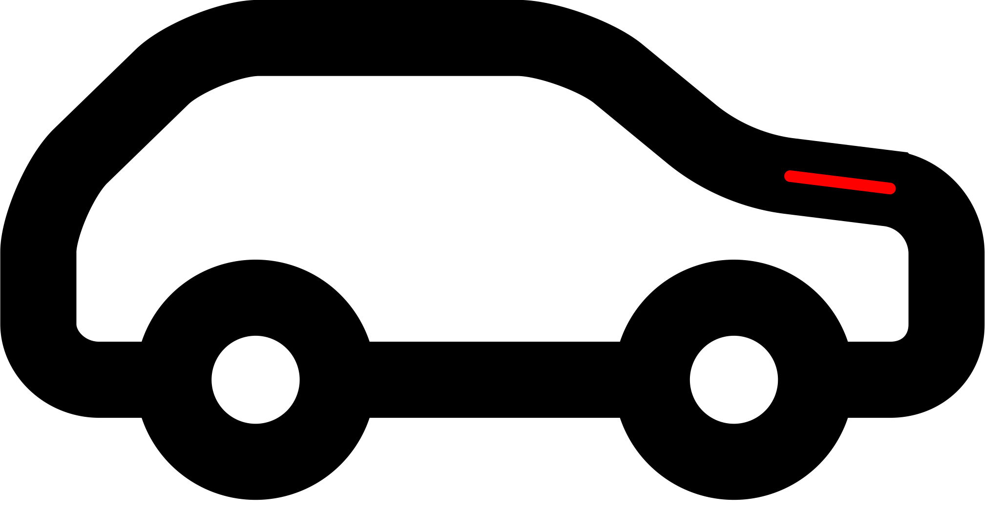{:.right-image-small}

~~~ markup
<svg xmlns="http://www.w3.org/2000/svg" viewBox="0 0 2580 1320">
  <path d="M 668,98 h 668 c 74,0 206,48 260,93 l 186,153
    c 72,60 164,100 257,111          a 171,171 0 0 1 146,165
    v 186 c 0,80 -59,143 -146,143 h -191
    a 212,212 0 1 1 -212,-212 212,212 0 1 1 -212,212
    H 871 a 212,212 0 1 1 -212,-212 212,212 0 1 1 -212,212
    H 256 c -90,0 -158,-70 -158,-144 V 651
    c 0,-64 54,-193 108,-247
    l 210,-204 c 48,-48 177,-102 251,-102 z"
    stroke="#000" stroke-width="197" fill="none"/>
</svg>
~~~

~~~ highlight

                            l 258,32
~~~

## Дуга

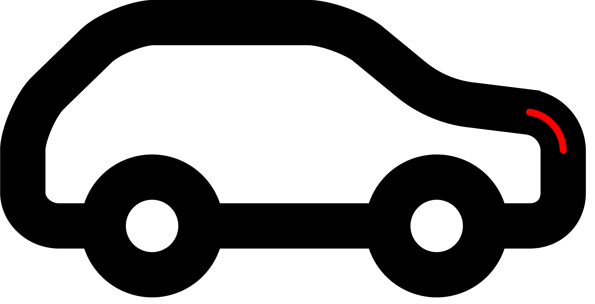{:.right-image-small}

~~~ markup
<svg xmlns="http://www.w3.org/2000/svg" viewBox="0 0 2580 1320">
  <path d="M 668,98 h 668 c 74,0 206,48 260,93 l 186,153
    c 72,60 164,100 257,111 l 258,32
    v 186 c 0,80 -59,143 -146,143 h -191
    a 212,212 0 1 1 -212,-212 212,212 0 1 1 -212,212
    H 871 a 212,212 0 1 1 -212,-212 212,212 0 1 1 -212,212
    H 256 c -90,0 -158,-70 -158,-144 V 651
    c 0,-64 54,-193 108,-247
    l 210,-204 c 48,-48 177,-102 251,-102 z"
    stroke="#000" stroke-width="197" fill="none"/>
</svg>
~~~

~~~ highlight

                                     a 171,171 0 0 1 146,165
~~~

## Вертикальная прямая

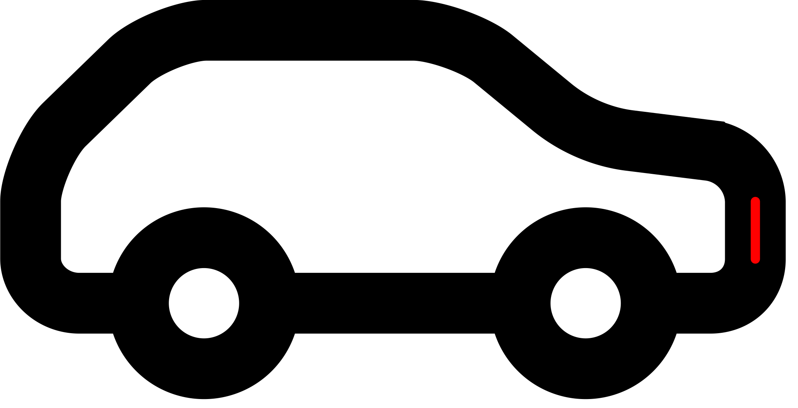{:.right-image-small}

~~~ markup
<svg xmlns="http://www.w3.org/2000/svg" viewBox="0 0 2580 1320">
  <path d="M 668,98 h 668 c 74,0 206,48 260,93 l 186,153
    c 72,60 164,100 257,111 l 258,32 a 171,171 0 0 1 146,165
          c 0,80 -59,143 -146,143 h -191
    a 212,212 0 1 1 -212,-212 212,212 0 1 1 -212,212
    H 871 a 212,212 0 1 1 -212,-212 212,212 0 1 1 -212,212
    H 256 c -90,0 -158,-70 -158,-144 V 651
    c 0,-64 54,-193 108,-247
    l 210,-204 c 48,-48 177,-102 251,-102 z"
    stroke="#000" stroke-width="197" fill="none"/>
</svg>
~~~

~~~ highlight

    v 186
~~~

## Помните?
{:.center}

{:.horizontal-big}

## Пример кода контура: логотип SVG

~~~ markup
<svg xmlns="http://www.w3.org/2000/svg" viewBox="0 0 300 300">
  <title>SVG Logo</title>
  <desc>Designed for the SVG Logo Contest in 2006 by Harvey Rayner, and
    adopted by W3C in 2009. It is available under the Creative Commons license
    for those who have an SVG product or who are using SVG on their site.</desc>
  <path d="M 175.34 69.29
    a 31.85 31.85 0 1 0 -50.69   0    V  88.8         l -13.78 -13.78
    a 31.85 31.85 0 1 0 -35.85  35.85 l  13.78  13.78 H  69.3
    a 31.85 31.85 0 1 0   0     50.71 h  19.5         l -13.78  13.78
    a 31.85 31.85 0 1 0  35.85  35.84 l  13.78 -13.78 v  19.5
    a 31.85 31.85 0 1 0  50.71   0    v -19.5         l  13.78  13.78
    a 31.85 31.85 0 1 0  35.85 -35.85 l -13.78 -13.78 h  19.5
    a 31.85 31.85 0 1 0   0    -50.71 h -19.5         l  13.78 -13.78
    a 31.85 31.85 0 1 0 -35.86 -35.83 L 175.35 88.8   z"
    fill="#ffb13b" stroke="#000" stroke-width="19"/>
</svg>
~~~

## Пример кода: логотип SVG

~~~ markup
<svg xmlns="http://www.w3.org/2000/svg"
     xmlns:xlink="http://www.w3.org/1999/xlink" viewBox="0 0 300 300">
  <title>SVG Logo</title>
  <desc>Designed for the SVG Logo Contest in 2006 by Harvey Rayner, and
    adopted by W3C in 2009. It is available under the Creative Commons license
    for those who have an SVG product or who are using SVG on their site.</desc>
  <g stroke-width="38" stroke="#000">
    <g id="b" transform="translate(150 150)">
      <path id="a" fill="#ffb13b" d="M-84.15,-15.85
        a22.417,22.417 0 1 0 0,31.7 h168.3 a22.417,22.417 0 1 0 0,-31.7z"/>
      <use xlink:href="#a" transform="rotate(45)"/>
      <use xlink:href="#a" transform="rotate(90)"/>
      <use xlink:href="#a" transform="rotate(135)"/>
    </g>
  </g>
  <use xlink:href="#b"/>
</svg>
~~~

## Текст

* Пишем текст
* Графические эффекты

## Группировка и переиспользование

## Иконки

## Маски

## Трансформации

## viewBox

## Маски

## Фильтры

## Анимация

* SMIL
* Javascript
* CSS анимации
* Будущее: Web Animations

## Методы вставки

* Object
* Iframe
* \
* CSS
* HTML5

## Object/Iframe

* Можно вставлять ссылки на внешние ресурсы
* Можно вставлять скрипты
* Доступно для JS страницы
* Трудно стилизовать, надо задавать размеры
* Не наследуются стили страницы

## \

* Нельзя вставлять ссылки на внешние ресурсы
* Нельзя вставлять скрипты
* Недоступно для JS страницы
* Браузер применит размеры картинки, если они есть
* Не наследуются стили страницы

## CSS

* Нельзя вставлять ссылки на внешние ресурсы
* Нельзя вставлять скрипты
* Недоступно для JS страницы
* Браузер применит размеры картинки, если они есть
* Не наследуются стили страницы
* Имеют почти все преимущества картинок в CSS (но есть баги)

## HTML5

* Можно вставлять ссылки на внешние ресурсы
* Можно  вставлять скрипты
* Единое глобальное пространство JS со страницей
* Браузер применит размеры картинки, если они есть
* Стили страницы наследуются.
* Можно переиспользовать элементы других SVG.

## **Контакты** {#contacts}

{{ site.author.name }}

{{ site.author.position }}

    

        <!-- 
+7 (000) 000-00-00
 -->
        
lev.sun@yandex.ru

        
@ruGreLI

        <!-- 
vk
 -->
        <!-- 
facebook
 -->
    

