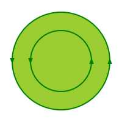
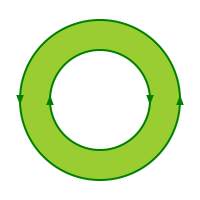
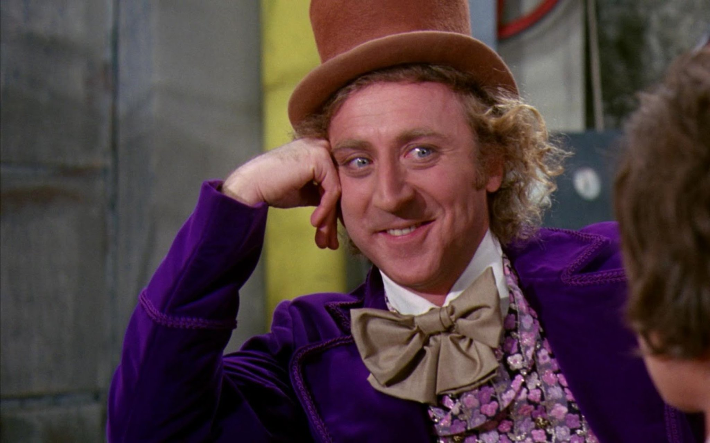
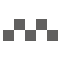
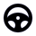
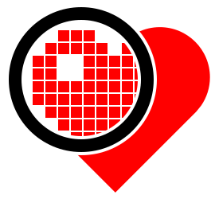
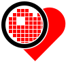
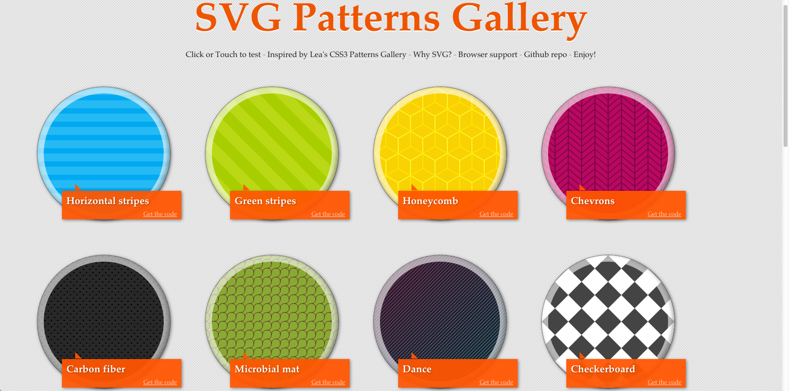

---

layout: default
title: Приручаем SVG

---

# Яндекс

## **{{ site.presentation.title }}** {#cover}

<!-- 

    
{{ site.presentation.service }}

 -->





  
{{ site.author.name }},   {{ site.author.position }}

## О докладчике

* 9 лет во фронтенде, 2 года в Яндексе.
* Мэйнтейнер SVGO с августа 2014 года.
* Люблю, когда красиво.

## Введение
{:.section}

### Что такое SVG

## SVG — Scalable Vector Graphics

### Спецификация: [www.w3.org/TR/SVG/](http://www.w3.org/TR/SVG/)

* Масштабируется
* Чётко выглядит при любых PPI
* В основе — XML
* Можно редактировать в текстовом редакторе
* Может иметь ссылки, растр, стили, скрипты

## Поддержка

* IE 9+ (базовая, улучшена в IE 10)
* Firefox 4+
* Chrome
* iOS
* Android 3+ (базовая, улучшена в 4.4)

## Пример кода: логотип SVG

~~~ markup
<svg xmlns="http://www.w3.org/2000/svg"
     xmlns:xlink="http://www.w3.org/1999/xlink" viewBox="0 0 300 300">
  <title>SVG Logo</title>
  <desc>Designed for the SVG Logo Contest in 2006 by Harvey Rayner, and
    adopted by W3C in 2009. It is available under the Creative Commons license
    for those who have an SVG product or who are using SVG on their site.</desc>
  <g stroke-width="38" stroke="#000">
    <g id="svgstar" transform="translate(150 150)">
      <path id="svgbar" fill="#ffb13b" d="M-84.15,-15.85
        a22.417,22.417 0 1 0 0,31.7 h168.3 a22.417,22.417 0 1 0 0,-31.7z"/>
      <use xlink:href="#svgbar" transform="rotate(45)"/>
      <use xlink:href="#svgbar" transform="rotate(90)"/>
      <use xlink:href="#svgbar" transform="rotate(135)"/>
    </g>
  </g>
  <use xlink:href="#svgstar"/>
</svg>
~~~

## Как выглядит в браузере: логотип SVG
{:.center}

{:.horizontal-big}

## Дорогой, вынеси мусор!
{:.section}

### Оптимизации

## Код из редактора

~~~ markup
<?xml version="1.0" encoding="utf-8"?>
<!-- Generator: Adobe Illustrator 15.0.0, SVG Export Plug-In . SVG Version: 6.00 Build 0)-->
<!DOCTYPE svg PUBLIC "-//W3C//DTD SVG 1.0//EN"
  "http://www.w3.org/TR/2001/REC-SVG-20010904/DTD/svg10.dtd">
<svg version="1.0" id="Layer_1" xmlns="http://www.w3.org/2000/svg"
     xmlns:xlink="http://www.w3.org/1999/xlink" x="0px" y="0px"
     width="48px" height="48px" viewBox="0 0 48 48"
     enable-background="new 0 0 48 48" xml:space="preserve">
<g>
  <g>
    <path fill-rule="evenodd" clip-rule="evenodd" fill="#004381" d="M40.883,34.118..."/>
  </g>
</g>
<path fill-rule="evenodd" clip-rule="evenodd" fill="#FF6C00" d="M26.325,10.19...z"/>
</svg>
~~~

## Убираем лишнее

~~~ markup

<svg                            xmlns="http://www.w3.org/2000/svg"

     width="48  " height="48  "
                                                           >

    <path fill-rule="evenodd" clip-rule="evenodd" fill="#004381" d="M40.883,34.118..."/>

<path fill-rule="evenodd" clip-rule="evenodd" fill="#FF6C00" d="M26.325,10.19...z"/>
</svg>
~~~

## SVGO — SVG Optimizer

### [github.com/svg/svgo](https://github.com/svg/svgo)

### [jakearchibald.github.io/svgomg/](https://jakearchibald.github.io/svgomg/) — SVGO's Missing GUI

~~~ bash
$ svgo test.svg test.min.svg
~~~

~~~ bash
$ svgo -s '<polyline points="30,270 80,230 150,260 220,220"/>' -o -
<path d="M30 270l50-40 70 30 70-40"/>
~~~

~~~ bash
$ svgo sprite.svg --disable=removeHiddenElems --precision 2
~~~

## Поверхность есть то, что имеет только длину и ширину. Края же поверхности — линии (Евклид)
{:.section}

### Начала

## Примитивы

{:.right-image}

~~~ markup
<rect x="0" y="0" width="100" height="60"
    rx="15" fill="skyblue"/>

<circle cx="150" cy="32" r="32" fill="pink"/>

<ellipse cx="120" cy="100" rx="100" ry="32"
    transform="rotate(10)" fill="peachpuff"/>

<line x1="15" y1="210" x2="255" y2="180"
    stroke="silver"/>

<polyline points="30,270 80,230 150,260 220,220
    290,230" stroke="tan" fill="none"/>

<polygon points="290,80 265,123.2 215,123.2 190,80 214.96,36.8 265,36.8"
    fill="lightgreen"/>
~~~
{:.top-code}

## Начинаем рисовать

{:.right-image}

~~~ markup
<rect x="6" y="3"
      width="32" height="32" rx="5"
      stroke="black" stroke-width="1"
      fill="none"/>
~~~

## Открыли в браузере

{:.right-image.pixelated}

~~~ markup
<rect x="6" y="3"
      width="32" height="32" rx="5"
      stroke="black" stroke-width="1"
      fill="none"/>
~~~

## Рисунок в пикселях

{:.right-image}

~~~ markup
<rect x="6" y="3"
      width="32" height="32" rx="5"
      stroke="black" stroke-width="1"
      fill="none"/>
~~~

## Сдвинутый рисунок в пикселях

{:.right-image}

~~~ markup
<rect x="6.5" y="3.5"
      width="32" height="32" rx="5"
      stroke="black" stroke-width="1"
      fill="none"/>
~~~

## Опять открыли в браузере

{:.right-image.pixelated}

~~~ markup
<rect x="6.5" y="3.5"
      width="32" height="32" rx="5"
      stroke="black" stroke-width="1"
      fill="none"/>
~~~

## &nbsp;
{:.with-big-quote}
> Даже векторная графика отображается в пикселях

## Пройдите пять шагов прямо, заверните за угол направо
{:.section}

### Контуры

## Логотип auto.ru

{:.right-image-small}

~~~ markup
<svg xmlns="http://www.w3.org/2000/svg" viewBox="0 0 2580 1320">
  <path d="M 668,98 h 668 c 74,0 206,48 260,93 l 186,153
    c 72,60 164,100 257,111 l 258,32 a 171,171 0 0 1 146,165
    v 186 c 0,80 -59,143 -146,143 h -191
    a 212,212 0 1 1 -212,-212 212,212 0 1 1 -212,212
    H 871 a 212,212 0 1 1 -212,-212 212,212 0 1 1 -212,212
    H 256 c -90,0 -158,-70 -158,-144 V 651
    c 0,-64 54,-193 108,-247
    l 210,-204 c 48,-48 177,-102 251,-102 z"
    stroke="#000" stroke-width="197" fill="none"/>
</svg>
~~~

## Начальная точка

{:.right-image-small}

~~~ markup
<svg xmlns="http://www.w3.org/2000/svg" viewBox="0 0 2580 1320">
  <path d="         h 668 c 74,0 206,48 260,93 l 186,153
    c 72,60 164,100 257,111 l 258,32 a 171,171 0 0 1 146,165
    v 186 c 0,80 -59,143 -146,143 h -191
    a 212,212 0 1 1 -212,-212 212,212 0 1 1 -212,212
    H 871 a 212,212 0 1 1 -212,-212 212,212 0 1 1 -212,212
    H 256 c -90,0 -158,-70 -158,-144 V 651
    c 0,-64 54,-193 108,-247
    l 210,-204 c 48,-48 177,-102 251,-102 z"
    stroke="#000" stroke-width="197" fill="none"/>
</svg>
~~~

~~~ highlight

           M 668,98
~~~

## Горинтальная прямая

{:.right-image-small}

~~~ markup
<svg xmlns="http://www.w3.org/2000/svg" viewBox="0 0 2580 1320">
  <path d="M 668,98       c 74,0 206,48 260,93 l 186,153
    c 72,60 164,100 257,111 l 258,32 a 171,171 0 0 1 146,165
    v 186 c 0,80 -59,143 -146,143 h -191
    a 212,212 0 1 1 -212,-212 212,212 0 1 1 -212,212
    H 871 a 212,212 0 1 1 -212,-212 212,212 0 1 1 -212,212
    H 256 c -90,0 -158,-70 -158,-144 V 651
    c 0,-64 54,-193 108,-247
    l 210,-204 c 48,-48 177,-102 251,-102 z"
    stroke="#000" stroke-width="197" fill="none"/>
</svg>
~~~

~~~ highlight

                    h 668
~~~

## Кривая Безье

{:.right-image-small}

~~~ markup
<svg xmlns="http://www.w3.org/2000/svg" viewBox="0 0 2580 1320">
  <path d="M 668,98 h 668                      l 186,153
    c 72,60 164,100 257,111 l 258,32 a 171,171 0 0 1 146,165
    v 186 c 0,80 -59,143 -146,143 h -191
    a 212,212 0 1 1 -212,-212 212,212 0 1 1 -212,212
    H 871 a 212,212 0 1 1 -212,-212 212,212 0 1 1 -212,212
    H 256 c -90,0 -158,-70 -158,-144 V 651
    c 0,-64 54,-193 108,-247
    l 210,-204 c 48,-48 177,-102 251,-102 z"
    stroke="#000" stroke-width="197" fill="none"/>
</svg>
~~~

~~~ highlight

                          c 74,0 206,48 260,93
~~~

## Прямая линия

{:.right-image-small}

~~~ markup
<svg xmlns="http://www.w3.org/2000/svg" viewBox="0 0 2580 1320">
  <path d="M 668,98 h 668 c 74,0 206,48 260,93
    c 72,60 164,100 257,111 l 258,32 a 171,171 0 0 1 146,165
    v 186 c 0,80 -59,143 -146,143 h -191
    a 212,212 0 1 1 -212,-212 212,212 0 1 1 -212,212
    H 871 a 212,212 0 1 1 -212,-212 212,212 0 1 1 -212,212
    H 256 c -90,0 -158,-70 -158,-144 V 651
    c 0,-64 54,-193 108,-247
    l 210,-204 c 48,-48 177,-102 251,-102 z"
    stroke="#000" stroke-width="197" fill="none"/>
</svg>
~~~

~~~ highlight

                                               l 186,153
~~~

## Кривая Безье

{:.right-image-small}

~~~ markup
<svg xmlns="http://www.w3.org/2000/svg" viewBox="0 0 2580 1320">
  <path d="M 668,98 h 668 c 74,0 206,48 260,93 l 186,153
                            l 258,32 a 171,171 0 0 1 146,165
    v 186 c 0,80 -59,143 -146,143 h -191
    a 212,212 0 1 1 -212,-212 212,212 0 1 1 -212,212
    H 871 a 212,212 0 1 1 -212,-212 212,212 0 1 1 -212,212
    H 256 c -90,0 -158,-70 -158,-144 V 651
    c 0,-64 54,-193 108,-247
    l 210,-204 c 48,-48 177,-102 251,-102 z"
    stroke="#000" stroke-width="197" fill="none"/>
</svg>
~~~

~~~ highlight

    c 72,60 164,100 257,111
~~~

## Прямая линия

{:.right-image-small}

~~~ markup
<svg xmlns="http://www.w3.org/2000/svg" viewBox="0 0 2580 1320">
  <path d="M 668,98 h 668 c 74,0 206,48 260,93 l 186,153
    c 72,60 164,100 257,111          a 171,171 0 0 1 146,165
    v 186 c 0,80 -59,143 -146,143 h -191
    a 212,212 0 1 1 -212,-212 212,212 0 1 1 -212,212
    H 871 a 212,212 0 1 1 -212,-212 212,212 0 1 1 -212,212
    H 256 c -90,0 -158,-70 -158,-144 V 651
    c 0,-64 54,-193 108,-247
    l 210,-204 c 48,-48 177,-102 251,-102 z"
    stroke="#000" stroke-width="197" fill="none"/>
</svg>
~~~

~~~ highlight

                            l 258,32
~~~

## Дуга

{:.right-image-small}

~~~ markup
<svg xmlns="http://www.w3.org/2000/svg" viewBox="0 0 2580 1320">
  <path d="M 668,98 h 668 c 74,0 206,48 260,93 l 186,153
    c 72,60 164,100 257,111 l 258,32
    v 186 c 0,80 -59,143 -146,143 h -191
    a 212,212 0 1 1 -212,-212 212,212 0 1 1 -212,212
    H 871 a 212,212 0 1 1 -212,-212 212,212 0 1 1 -212,212
    H 256 c -90,0 -158,-70 -158,-144 V 651
    c 0,-64 54,-193 108,-247
    l 210,-204 c 48,-48 177,-102 251,-102 z"
    stroke="#000" stroke-width="197" fill="none"/>
</svg>
~~~

~~~ highlight

                                     a 171,171 0 0 1 146,165
~~~

## Вертикальная прямая

{:.right-image-small}

~~~ markup
<svg xmlns="http://www.w3.org/2000/svg" viewBox="0 0 2580 1320">
  <path d="M 668,98 h 668 c 74,0 206,48 260,93 l 186,153
    c 72,60 164,100 257,111 l 258,32 a 171,171 0 0 1 146,165
          c 0,80 -59,143 -146,143 h -191
    a 212,212 0 1 1 -212,-212 212,212 0 1 1 -212,212
    H 871 a 212,212 0 1 1 -212,-212 212,212 0 1 1 -212,212
    H 256 c -90,0 -158,-70 -158,-144 V 651
    c 0,-64 54,-193 108,-247
    l 210,-204 c 48,-48 177,-102 251,-102 z"
    stroke="#000" stroke-width="197" fill="none"/>
</svg>
~~~

~~~ highlight

    v 186
~~~

## Замыкание контура

{:.right-image-small}

~~~ markup
<svg xmlns="http://www.w3.org/2000/svg" viewBox="0 0 2580 1320">
  <path d="M 668,98 h 668 c 74,0 206,48 260,93 l 186,153
    c 72,60 164,100 257,111 l 258,32 a 171,171 0 0 1 146,165
    v 186 c 0,80 -59,143 -146,143 h -191
    a 212,212 0 1 1 -212,-212 212,212 0 1 1 -212,212
    H 871 a 212,212 0 1 1 -212,-212 212,212 0 1 1 -212,212
    H 256 c -90,0 -158,-70 -158,-144 V 651
    c 0,-64 54,-193 108,-247
    l 210,-204 c 48,-48 177,-102 251,-102  "
    stroke="#000" stroke-width="197" fill="none"/>
</svg>
~~~

~~~ highlight

                                          z
~~~

## Правила заливки

### `fill-rule="nonzero"`

| Разное направление | Одно направление |
|  |  |
{:.frameless}

## Правила заливки

| `fill-rule="nonzero"` | `fill-rule="evenodd"` |
| <svg class="svg" width="200" height="200"><path stroke="orange" stroke-width="2" fill="gold" fill-rule="nonzero" d="M 100,20 L 50,180 180,80 20,80 150,180 z"></path></svg> | <svg class="svg" width="200" height="200"><path stroke="orange" stroke-width="2" fill="gold" fill-rule="evenodd" d="M 100,20 L 50,180 180,80 20,80 150,180 z"></path></svg> |
{:.frameless}

## Давай, расскажи мне
{:.section}

### Использование

## 
{:.cover .w}

## Такси

{:.right-image-small}

~~~ markup
<svg xmlns="http://www.w3.org/2000/svg" viewBox="0 0 62 62">
  <g fill="#61605F">
    <rect x="3"  y="30" width="11" height="11"/>
    <rect x="14" y="19" width="11" height="11"/>
    <rect x="25" y="30" width="11" height="11"/>
    <rect x="36" y="19" width="11" height="11"/>
    <rect x="47" y="30" width="11" height="11"/>
  </g>
</svg>
~~~

## Такси

{:.right-image-small}

~~~ markup
<svg xmlns="http://www.w3.org/2000/svg" viewBox="0 0 62 62">
  <path fill="#61605F"
        d="M3 30v11h11v-22h11v22h11v-22h11v22h11v-11z"/>
</svg>
~~~

## 
{:.cover .white .h}

## Руль

{:.right-image-small}

~~~ markup
<svg xmlns="http://www.w3.org/2000/svg" viewBox="0 0 40 40">
  <path d="M20 4 c-8.836 0-16 7.164-16 16 0 8.837 7.164 16 16 16
      s16-7.163 16-16 c0-8.836-7.164-16-16-16 z
      m0 4 c6.343 0 11.523 4.926 11.957 11.158
           -2.965-3.159-7.217-5.151-11.957-5.151
           -4.741 0-8.992 1.992-11.958 5.152
             .434-6.233 5.615-11.159 11.958-11.159 z
      m0 13.989 c-1.104 0-1.998-.895-1.998-1.998
      s.895-1.998 1.998-1.998 1.998.895 1.998 1.998-.894 1.998-1.998 1.998 z
      m-11.228 2.214 c.87-.749 1.997-1.206 3.236-1.206 2.759 0 4.995 2.236 4.995 4.995
         0 1.239-.458 2.366-1.208 3.235-3.24-1.213-5.809-3.783-7.023-7.024 z
      m15.432 7.025 c-.75-.869-1.208-1.996-1.208-3.235 0-2.759 2.237-4.995 4.996-4.995
        1.238 0 2.366.457 3.236 1.206-1.214 3.24 -3.783 5.81-7.024 7.024 z"/>
</svg>
~~~

## Ободок руля

{:.horizontal}

~~~ markup
<svg xmlns="http://www.w3.org/2000/svg" viewBox="0 0 40 40">
  <circle cx="20" cy="20" r="14" fill="none" stroke="#000" stroke-width="4"/>
</svg>
~~~

## Внутренности руля

{:.horizontal}

~~~ markup
<svg xmlns="http://www.w3.org/2000/svg" viewBox="0 0 40 40">
  ???
</svg>
~~~

## Внутренности руля

{:.horizontal}

~~~ markup
<path d="M28 33 a5 5 0 1 1 5-5 V20.46
         a15.52 14.24 0 0 0 -26 0 V28
         a5 5 0 1 1 5 5
         m8-11 a2 2 0 1 1 .1 0"/>
~~~

## Всё вместе

{:.horizontal}

~~~ markup
<svg xmlns="http://www.w3.org/2000/svg" viewBox="0 0 40 40">
  <path d="M28 33 a5 5 0 1 1 5-5 V20.46 a15.52 14.24 0 0 0 -26 0 V28
           a5 5 0 1 1 5 5 m8-11 a2 2 0 1 1 .1 0"/>
  <circle cx="20" cy="20" r="14" fill="none" stroke="#000" stroke-width="4"/>
</svg>
~~~

## Сделайте как тут, только по-другому
{:.section}

### Переиспользование

## Помните?
{:.center}

{:.horizontal-big}

## Пример контура: логотип SVG

~~~ markup
<svg xmlns="http://www.w3.org/2000/svg" viewBox="0 0 300 300">
  <title>SVG Logo</title>
  <desc>Designed for the SVG Logo Contest in 2006 by Harvey Rayner, and
    adopted by W3C in 2009. It is available under the Creative Commons license
    for those who have an SVG product or who are using SVG on their site.</desc>
  <path d="M 175.34 69.29
    a 31.85 31.85 0 1 0 -50.69   0    V  88.8         l -13.78 -13.78
    a 31.85 31.85 0 1 0 -35.85  35.85 l  13.78  13.78 H  69.3
    a 31.85 31.85 0 1 0   0     50.71 h  19.5         l -13.78  13.78
    a 31.85 31.85 0 1 0  35.85  35.84 l  13.78 -13.78 v  19.5
    a 31.85 31.85 0 1 0  50.71   0    v -19.5         l  13.78  13.78
    a 31.85 31.85 0 1 0  35.85 -35.85 l -13.78 -13.78 h  19.5
    a 31.85 31.85 0 1 0   0    -50.71 h -19.5         l  13.78 -13.78
    a 31.85 31.85 0 1 0 -35.86 -35.83 L 175.35 88.8   z"
    fill="#ffb13b" stroke="#000" stroke-width="19"/>
</svg>
~~~

## Подробный взгляд: логотип SVG

~~~ markup
<svg xmlns="http://www.w3.org/2000/svg"
     xmlns:xlink="http://www.w3.org/1999/xlink" viewBox="0 0 300 300">
  <title>SVG Logo</title>
  <desc>Designed for the SVG Logo Contest in 2006 by Harvey Rayner, and
    adopted by W3C in 2009. It is available under the Creative Commons license
    for those who have an SVG product or who are using SVG on their site.</desc>
  <g stroke-width="38" stroke="#000">
    <g id="svgstar" transform="translate(150 150)">
      <path id="svgbar" fill="#ffb13b" d="M -84.15,-15.85
        a 22.417,22.417 0 1,0 0,31.7 h 168.3 a 22.417,22.417 0 1,0 0,-31.7 z"/>
      <use xlink:href="#svgbar" transform="rotate(45)"/>
      <use xlink:href="#svgbar" transform="rotate(90)"/>
      <use xlink:href="#svgbar" transform="rotate(135)"/>
    </g>
  </g>
  <use xlink:href="#svgstar"/>
</svg>
~~~

## Переиспользование

{:.right-image-small}

~~~ markup
<svg xmlns="http://www.w3.org/2000/svg"
     xmlns:xlink="http://www.w3.org/1999/xlink"
     viewBox="0 0 22 16">
  <g fill="#669">
    <path id="pin" d="
      M10 5a5 5 0 1 0 -5 5L5 9.97l-1.94 6C6.63 11 10 9 10 5
      M5 8.35a3.38 3.38 0 0 1 0-6.76 3.38 3.38 0 0 1 0 6.76
      m0-5a1.63 1.63 0 0 0 0 3.26 1.63 1.63 0 0 0 0-3.26"/>
  </g>
  <use x="12" fill="red" xlink:href="#pin"/>
</svg>
~~~

## Спрайты в HTML

### [<svg><use xlink:href="#pin"></use></svg> ул. Льва Толстого, 16](//yandex.ru){:.tcolor}

~~~ markup
<!DOCTYPE html>
...
<svg xmlns="http://www.w3.org/2000/svg" xmlns:xlink="http://www.w3.org/199fkj9/xlink">
  <symbol id="pin" viewBox="0 0 10 16">
    <path fill="currentColor" d="
      M10 5a5 5 0 1 0 -5 5L5 9.97l-1.94 6C6.63 11 10 9 10 5
      M5 8.35a3.38 3.38 0 0 1 0-6.76 3.38 3.38 0 0 1 0 6.76
      m0-5a1.63 1.63 0 0 0 0 3.26 1.63 1.63 0 0 0 0-3.26"></path>
  </symbol>
</svg>
...
<a href="//yandex.ru">
  <svg><use xlink:href="#pin"></use></svg>
  ул. Льва Толстого, 16
</a>
~~~

## Чёрточка, квадратик, чёрточка. Повторить 60 раз
{:.section}

### Паттерны

## dpi.lv
{:.center}

{:.horizontal-big}

## Логотип dpi love

~~~ markup
<svg xmlns="http://www.w3.org/2000/svg" xmlns:xlink="http://www.w3.org/1999/xlink"
     viewBox="0 0 270 250">
  <defs>
    <rect id="base-pixel" width="16" height="16" stroke="white" stroke-width="2"/>
    <use xlink:href="#base-pixel" fill="white" id="glow-pixel"/>
    <use xlink:href="#base-pixel" fill="red" id="pixel"/>
    <circle cx="102" cy="100" r="83" fill="none" id="magnifier"/>
  </defs>
  <path fill="red" d="M200.71,34.103c-9.912,0-19.285,2.294-27.624,6.376...z"/>
  <use xlink:href="#pixel" x="40" y="69"/>
  <use xlink:href="#pixel" x="40" y="85"/>
  <use xlink:href="#pixel" x="40" y="101" />
  ... всего 61 раз ...
  <use xlink:href="#pixel" x="168" y="117"/>
  <use xlink:href="#magnifier" stroke="white" stroke-width="24"/>
  <use xlink:href="#magnifier" stroke="black" stroke-width="16"/>
</svg>
~~~

## It's a pattern time!

{:.right-image-small}

~~~ markup
<svg xmlns="http://www.w3.org/2000/svg" viewBox="0 0 100 93">
<pattern id="grid" x="6" y="6" width="6" height="6"
         patternUnits="userSpaceOnUse">
  <rect width="6" height="6" fill="white"/>
  <rect x="1" y="1" width="5" height="5" fill="red"/>
</pattern>
<path fill="red" d="M33.5,70.65L51.69,88.84l37.16-37.16
  c.32-.31,.64-.62,.94-.94l2.3-2.84c2.62-3.8,4.15-8.4,4.15-13.37
  c0-13.04-10.57-23.61-23.61-23.61c-3.72,0-7.23,.86-10.36,2.39z"/>
<path d="M12.5,24.5h6v-6h6v-6h18v6h6v6h6v-6h6v6h6v24h-6v12h-12
  v6h-18v-6h-6v-6h-6v-6h-6zm12,0v12h12v-12z" fill="url(#grid)"/>
<circle fill="none" stroke="white" stroke-width="9" cx="36" cy="36" r="31"/>
<circle fill="none" stroke="black" stroke-width="6" cx="36" cy="36" r="31"/>
</svg>
~~~

### [github.com/LeaVerou/dpi/commit/9e51d2](https://github.com/LeaVerou/dpi/commit/9e51d2f3e6bb0a6e441675bd75b4065034e5e123)

## [philbit.com/svgpatterns/](http://philbit.com/svgpatterns/)
{:.center}

{:.tmp width="951" height="471"}
<!-- 1605×795 -->

## MOAR!!!
{:.section}

### Дополнительные материалы

## Полезные ссылки

* Карманное руководство по написанию SVG: 
[css-live.ru/articles/karmannoe-rukovodstvo-po-napisaniyu-svg-vvedenie.html](http://css-live.ru/articles/karmannoe-rukovodstvo-po-napisaniyu-svg-vvedenie.html)
* Много подробных публикаций про SVG: [css.yoksel.ru](http://css.yoksel.ru/)
* Полезные ссылки про SVG: [css.yoksel.ru/pages/svg-links.html](http://css.yoksel.ru/pages/svg-links.html)
* A Compendium of SVG Information:
[css-tricks.com/mega-list-svg-information](https://css-tricks.com/mega-list-svg-information/)

## Посмотреть

* «Я ♥ SVG». Владимир Кузнецов: [events.yandex.ru/lib/talks/2234/](https://events.yandex.ru/lib/talks/2234/)
* «Оживляем текст». Юлия Бухвалова: [youtube.com/watch?v=XB7MdbFxPzc](https://www.youtube.com/watch?v=XB7MdbFxPzc) Презентация: [2015.codefest.ru/upload/presentation/2015/yoksel/](http://2015.codefest.ru/upload/presentation/2015/yoksel/)
* «Styling and Animating Scalable Vector Graphics with CSS». Sara Soueidan: [youtube.com/watch?v=lf7L8X6ZBu8](https://www.youtube.com/watch?v=lf7L8X6ZBu8)

## **Контакты** {#contacts}

{{ site.author.name }}

{{ site.author.position }}

    

        <!-- 
+7 (000) 000-00-00
 -->
        
lev.sun@yandex.ru

        
@ruGreLI

    

<!-- Для ссылок -->

<svg xmlns="http://www.w3.org/2000/svg" xmlns:xlink="http://www.w3.org/1999/xlink">
  <symbol id="pin" viewBox="0 0 10 16">
    <path fill="currentColor" d="
      M10 5a5 5 0 1 0 -5 5L5 9.97l-1.94 6C6.63 11 10 9 10 5
      M5 8.35a3.38 3.38 0 0 1 0-6.76 3.38 3.38 0 0 1 0 6.76
      m0-5a1.63 1.63 0 0 0 0 3.26 1.63 1.63 0 0 0 0-3.26">
    </path>
  </symbol>
</svg>
